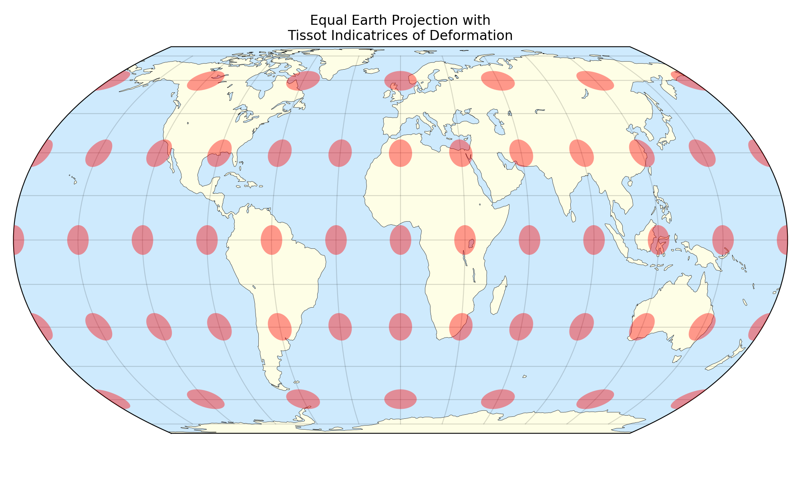

Equal Earth Projection
======================
The Equal Earth map projection is a `matplotlib` add-on based on the
projection developed by Bojan Šavrič (@BojanSavric), Tom Patterson and
Bernhard Jenny:

>The Equal Earth map projection is a new equal-area pseudocylindrical
>projection for world maps. It is inspired by the widely used Robinson
>projection, but unlike the Robinson projection, retains the relative size
>of areas. The projection equations are simple to implement and fast to
>evaluate. Continental outlines are shown in a visually pleasing and
>balanced way.

* https://doi.org/10.1080/13658816.2018.1504949
* https://www.researchgate.net/publication/326879978_The_Equal_Earth_map_projection

where:

* λ and φ are the longitude and the latitude, respectively
* θ is a parametric latitude
* A1 =  1.340264
* A2 = -0.081106
* A3 =  0.000893
* A4 =  0.003796

Full Documentation
------------------
Full documentation is at: https://github.com/dneuman/EqualEarth

Requirements
------------
shapefile (from pyshp) is required to read the map data. This is available
from Anaconda, but must be installed first, from the command line::

    >>>conda install shapefile

Usage
-----
Importing the module causes the Equal Earth projection to be registered with
Matplotlib so that it can be used when creating a subplot:

    >>>import matplotlib.pyplot as plt
    >>>import EqualEarth
    >>>longs = [-110, 100, 100, -110]
    >>>lats = [40, 40, -40, 40]
    >>>fig = plt.figure('Equal Earth Projection')
    >>>ax = fig.add_subplot(111, projection='equal_earth')
    >>>ax.plot(longs, lats)
    >>>plt.grid(True)
    >>>plt.show()

Note that the default behaviour is to take all data in degrees. If radians
are preferred, use the `rad=True` optional keyword in `fig.add_subplot()`,
ie:

    >>>ax = fig.add_subplot(111, projection='equal_earth', rad=True)

All plots must be done in radians at this point.

New in This Version (2.0)
-------------------------
DrawCoastlines:
    World map data from `Natural Earth <https://www.naturalearthdata.com>`_
    will download into the `maps` folder in the same directory as the
    Equal Earth module. This is 500kb on disk, but is downloaded in .zip format
    and unzipped automatically. Other maps can be used if you supply the shape
    files. Once the axes is set up, you can draw the continents::

        >>>ax.DrawCoastlines(facecolor='grey', edgecolor='none')

Great Circle (geodesic) lines:
    Navigation lines can be plotted using the shortest path on the globe. These
    lines take plot keywords and wrap around if necessary::

        >>>pts = np.array([[-150, 45], [150, 45]])
        >>>ax.plot_geodesic(pts, 'b:', linewidth=1, alpha=.8)

Tissot Indicatrix of Distortion:
    Circles can be plotted at regular intervals on the projection to show
    map distortion at various places::

        >>>ax.DrawTissot(width=10.)

Plot Note
---------
Lines drawn by `ax.plot()` method are clipped by the projection if any portions
are outside it due to points being greater than +/- 180° in longitude. If you
want to show lines wrapping around, they must be drawn twice. The second time
will require the outside points put back into the correct range, but with their
connecting points now outside the projection.

Future Work
-----------
Ideally, this projection should be in Cartopy, where there are far more
features available. I will be doing what I can to make this happen.

Sources
-------
Based on code from:
* https://matplotlib.org/gallery/misc/custom_projection.html

as well as code from @mbostock:
* https://beta.observablehq.com/@mbostock/equal-earth-projection

@Author: Dan Neuman (@dan613)

